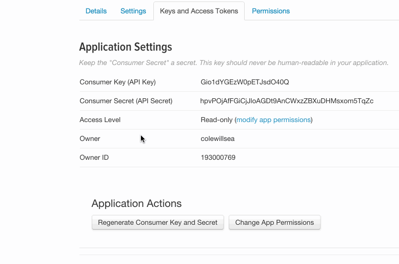

### twitter API key formatting as a service
--------------------------------------



Go to dev.twitter.com and copy the entire API keys page, 

come to [this page](http://coleww.github.io/tweet-key-formatter/) and paste it to the page,

get yr keys formatted just like how [twit](https://github.com/ttezel/twit) expects

```
{
    consumer_key:         '...', 
    consumer_secret:      '...', 
    access_token:         '...', 
    access_token_secret:  '...'
}
```

